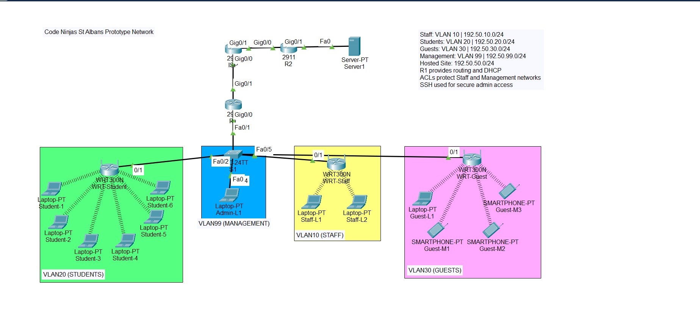

# Code Ninjas Network Design

## Overview

This project is a Cisco Packet Tracer implementation of a secure multi-VLAN network designed for a training centre environment.

The network separates staff, students, guests, and administrators into dedicated VLANs, provides DHCP services, supports wireless connectivity, enables secure remote administration through SSH, and connects to a hosted services network through a simulated ISP infrastructure.

The project demonstrates practical networking skills including VLAN segmentation, router-on-a-stick inter-VLAN routing, DHCP configuration, static routing, ACL implementation, wireless networking, and network security controls.

## Key Features

* VLAN segmentation for Staff, Students, Guests, and Management
* Router-on-a-stick inter-VLAN routing
* DHCP address allocation
* Hosted services network
* Static routing across multiple routers
* Access Control Lists (ACLs)
* Secure SSH administration
* Wireless network deployment using multiple SSIDs
* WAN-style connectivity through an ISP router
* Security-focused network design

## Network Topology

## Network Architecture

### Internal Networks

| VLAN    | Purpose    | Network        |
| ------- | ---------- | -------------- |
| VLAN 10 | Staff      | 192.50.10.0/24 |
| VLAN 20 | Students   | 192.50.20.0/24 |
| VLAN 30 | Guests     | 192.50.30.0/24 |
| VLAN 99 | Management | 192.50.99.0/24 |

### Hosted Services

| Purpose               | Network        |
| --------------------- | -------------- |
| Hosted Server Network | 192.50.50.0/24 |

### Routing Infrastructure

* R1 – Internal routing and DHCP services
* ISP Router – Simulated external connectivity
* R2 – Hosted services connectivity
* Server1 – Hosted service network

## Security Controls

* VLAN-based network segmentation
* ACLs restricting access to Staff and Management networks
* SSH for secure administrative access
* Separate wireless SSIDs for each user group
* Least-privilege access design

## Project Files

* CodeNinjas_WBL_A4_v1.pkt
* CodeNinjas_FinalProposal.pdf
